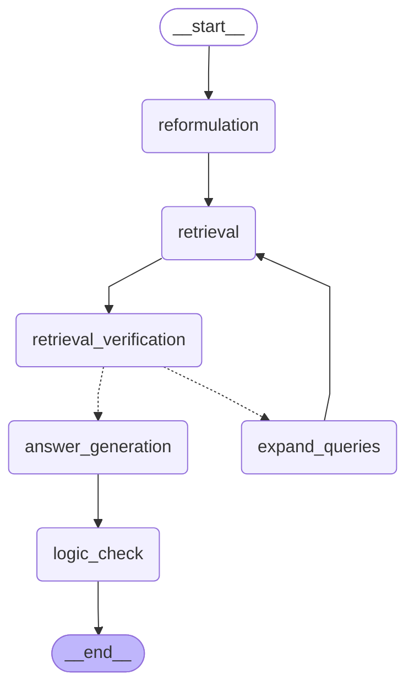

# Agentic RAG

## Table of Contents
1. [Overview](#overview)
2. [Development](#development)
3. [Reproducibility](#reproducibility)
4. [Project Structure](#project-structure)
5. [Reusing the package](#reusing-the-package)
5. [Contributors](#contributors)

## Overview
***
This project implements a Hybrid RAG (Retrieval-Augmented Generation) system that combines both visual and textual retrieval to build a more robust and versatile chatbot. The system leverages the strengths of both modalities to retrieve relevant information from a knowledge base while generating coherent and contextually appropriate responses.

The pipeline is designed to iteratively refine the retrieval and generation process. First, the user query is reformulated into multiple sub-queries to better capture the underlying information needed and are then used to retrieve relevant documents from both textual and visual databases.

Then an agent evaluates whether the retrieved documents are sufficient to answer the query and if the retrieved information is incomplete or insufficient, the system generates additional queries to enrich the context and improve coverage. This retrieval loop continues until the agent determines that the information is adequate or if a predefined number of iterations is reached.

Once sufficient context is gathered, the system generates an initial answer and a second agent then reviews this answer to ensure its quality and relevance before returning the final response to the user.

Here is a visual representation of the pipeline:



## Development
***
This project follows the best practices we currently rely on for building maintainable Python projects. We use:

- **`uv`** for dependency management  
- **`pre-commit`** for automated code quality checks  
- **`Ruff`** for linting and formatting (a VS Code configuration is included)  
- **`Makefile`** to run common commands consistently

### Requirements
***
- **Python 3.12**
- [**`uv`**](https://docs.astral.sh/uv/) (recommended) for dependency management and editable installs (alternatively, you can use `pip install -e .` and manage dependencies via `requirements.txt`).
- **`make`** (recommended) to use the provided Makefile commands (alternatively, you can execute the underlying commands manually).
- [**`docker`**](https://www.docker.com/) (recommended) to run the database locally in a containerized environment (alternatively, you can set up a local database without Docker, but make sure to update the connection settings accordingly).
- [**`ollama`**](https://ollama.com/) (required) is used to run the local LLMs that power the agents (the agent architecture is built around Ollama rather than external API calls). You can run any model you prefer, but be sure to update the configuration accordingly and download the necessary models before running the agents (e.g., `ollama pull ministral-3:3b`).

### Environment setup
***
Install dependencies and set up `pre-commit` hooks:
```bash
make install
```

### Code quality
***
Run linting/formatting checks via `pre-commit`:
```bash
make pre-commit
```

## Reproducibility
***

### Database setup
To reproduce the project results, you first need to initialize the databases. Start by launching the database container, which runs a Qdrant instance:
```bash
make launch-db
```
Once the database is fully running, populate it with the required data:
- For the textual data:
```bash
make process-textual
```
- For the visual data:
```bash
make process-visual
```

### Training
***
After setting up the databases, train the scorer model used in the retrieval step:
```bash
make train-scorer
```

### Evaluation
***
Finally, to evaluate the performance of the retrieval part, configure the appropriate parameter in the [`config.py`](src/scripts/pipeline/config.py) file then run:
```bash
make evaluate-rag
```
You can also run a full pipeline example with the trained models:
```bash
make execution-duration
```

### Application
***
Finally if you want to test the app you can launch the Streamlit interface with:
```bash
make launch-app
```

## Project Structure
This repository is organized like a typical Python package so that you can reuse the structure easily for future projects. You will then find 
- in the [`agentic_rag`](src/agentic_rag/) folder the core package 
- in the [`scripts`](src/scripts/) folder the scripts to run the different steps of the pipeline. 

The rest of the folders are organized as follows:

- **[`data/`](./data/)** : Folder to store the images of the dataset
- **[`database/`](./database/)** : Folder to store the database (mounted files)
- **[`models/`](./models/)** : Stores trained model weights
- **[`src/`](./src/)** : Main source code directory

## Reusing the package
You can also install this package independently in any of your projects with:
```bash
uv add git+https://github.com/Bliights/Agentic-RAG
```
or
```bash
pip install git+https://github.com/Bliights/Agentic-RAG
```


## Contributors
***

|            Name            |                   Email                   |
| :------------------------: | :---------------------------------------: |
|    MOLLY-MITTON Clément    |    clement.molly-mitton@student-cs.fr     |
|       VERBECQ DIANE        |        diane.verbecq@student-cs.fr        |
|       HANUS Maxime         |        maxime.hanus@student-cs.fr         |
|      GUIGNARD Quentin      |      quentin.guignard@student-cs.fr       |
|       LASNE Corentin       |       corentin.lasne@student-cs.fr        |